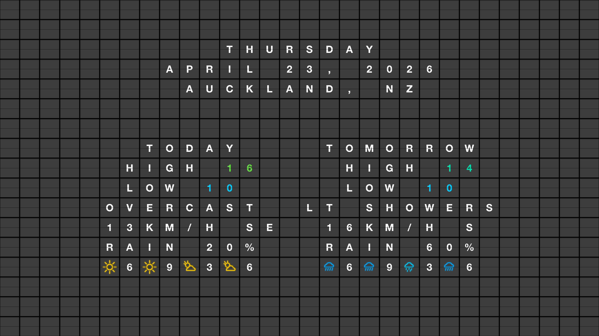

# FlipOff.

**Turn any TV into a retro split-flap display.** The classic flip-board look, without the $3,500 hardware. And it's free.



## What is this?

FlipOff is a free, open-source web app that emulates a classic mechanical split-flap (flip-board) airport terminal display — the kind you'd see at train stations and airports. It runs full-screen in any browser, turning a TV or large monitor into a beautiful retro display.

No accounts. No subscriptions. No $199 fee. Just open `index.html` and go.

## Features

- Realistic split-flap animation with colorful scramble transitions
- Authentic mechanical clacking sound (recorded from a real split-flap display)
- Auto-rotating inspirational quotes
- **Weather display with colourful icons** — sun, rain, fog, snow, thunderstorms, and more
- **Temperature-coloured numbers** — blue for cold, red for hot, with fixed colour bands
- **Samsung Frame TV integration** — push 4K screenshots to art mode
- Fullscreen TV mode (press `F`)
- Keyboard controls for manual navigation
- Works offline — zero external dependencies
- Responsive from mobile to 4K displays
- Pure vanilla HTML/CSS/JS — no frameworks, no build tools, no npm

## Quick Start

### Browser Display

1. Clone the repo
2. Open `index.html` in a browser (or serve with any static file server)
3. Click anywhere to enable audio
4. Press `F` for fullscreen TV mode

```bash
# Or serve locally:
python3 -m http.server 8080
# Then open http://localhost:8080
```

### Samsung Frame TV (Weather Kiosk)

The CLI generates a weather display and pushes it to a Samsung Frame TV as art mode content.

```bash
# 1. Install dependencies
pip install playwright websocket-client
playwright install chromium

# 2. Configure your location and TV
cp cli/.env.example cli/.env
# Edit cli/.env with your coordinates, timezone, and TV IP

# 3. Generate and push
python3 cli/flipframe.py push

# Or just generate screenshots
python3 cli/flipframe.py generate

# Or preview in your browser
python3 cli/flipframe.py preview

# Or serve a live animated display on your LAN
python3 cli/flipframe.py live
```

### Configuration

Copy `cli/.env.example` to `cli/.env` and set your values:

```env
# Location (for weather data)
FLIPFRAME_LATITUDE=-36.85
FLIPFRAME_LONGITUDE=174.76
FLIPFRAME_TIMEZONE=Pacific/Auckland
FLIPFRAME_LOCATION=AUCKLAND, NZ

# Samsung Frame TV IP
FLIPFRAME_TV_IP=192.168.1.100
```

All settings can also be set as environment variables.

### Automatic Daily Refresh

Use cron to update the TV display daily:

```bash
# Edit crontab
crontab -e

# Add (runs at 5:30 AM daily):
30 5 * * * /path/to/flipoff/cli/refresh.sh
```

## Weather Icons

The weather display includes colourful SVG icons rendered directly on the split-flap tiles:

| Icon | Condition | Colour |
|------|-----------|--------|
| ☀️ | Clear / Mainly Clear | Golden |
| ⛅ | Partly Cloudy | Golden + cloud |
| ☁️ | Overcast | Grey |
| 🌫️ | Fog | Icy blue |
| 🌦️ | Drizzle / Light showers | Cyan |
| 🌧️ | Rain | Blue |
| 🌧️🌧️ | Heavy rain | Deep blue |
| ❄️ | Snow | White-blue |
| ⛈️ | Thunderstorm | Purple |

Temperature numbers are colour-coded by fixed bands — blue (≤5°C), cyan, teal, green, yellow, orange, and red (27°C+).

## Keyboard Shortcuts

| Key | Action |
|-----|--------|
| `Enter` / `Space` | Next message |
| `Arrow Left` | Previous message |
| `Arrow Right` | Next message |
| `F` | Toggle fullscreen |
| `M` | Toggle mute |
| `Escape` | Exit fullscreen |

## How It Works

Each tile on the board is an independent element that can animate through a scramble sequence (rapid random characters with colored backgrounds) before settling on the final character. Only tiles whose content changes between messages animate — just like a real mechanical board.

The sound is a single recorded audio clip of a real split-flap transition, played once per message change to perfectly sync with the visual animation.

Weather data comes from the [Open-Meteo API](https://open-meteo.com/) (free, no API key needed).

## File Structure

```
flipoff/
  index.html              — Single-page app (quotes display)
  kiosk.html              — Weather kiosk display (used by CLI)
  css/
    reset.css             — CSS reset
    layout.css            — Page layout (header, hero, board)
    board.css             — Board container and accent bars
    tile.css              — Tile styling, flip animation, weather icons
    kiosk.css             — Kiosk-specific styles
    responsive.css        — Media queries for all screen sizes
  js/
    main.js               — Entry point and UI wiring
    Board.js              — Grid manager and transition orchestration
    Tile.js               — Tile animation + weather icon SVG rendering
    SoundEngine.js        — Audio playback with Web Audio API
    MessageRotator.js     — Quote rotation timer
    KeyboardController.js — Keyboard shortcut handling
    constants.js          — Config (grid size, colors, quotes, weather icons)
    kiosk.js              — Kiosk mode entry point
    flapAudio.js          — Embedded audio data (base64)
  cli/
    flipframe.py          — Content generator + TV push tool
    refresh.sh            — Cron helper script
    .env.example          — Configuration template
```

## Customization

Edit `js/constants.js` to change:
- **Messages**: Add your own quotes or text
- **Grid size**: Adjust `GRID_COLS` and `GRID_ROWS`
- **Timing**: Tweak `SCRAMBLE_DURATION`, `STAGGER_DELAY`, etc.
- **Colors**: Modify `SCRAMBLE_COLORS` and `ACCENT_COLORS`
- **Temperature bands**: Adjust `tempColor()` thresholds
- **Weather icon colors**: Edit `WEATHER_ICONS` color values

## License

MIT — do whatever you want with it.
